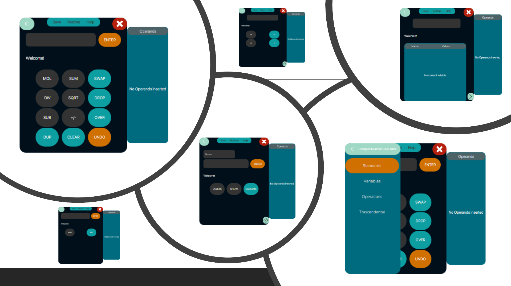

# Scientific Programmable Complex Calculator

  

The target of this project is to develop an application implementing a Scientific Programmable Calculator supporting complex numbers. The calculator supports basic operations on complex numbers such as addition, subtraction, multiplication, division, square root, and sign inversion. It also includes operations on the stack containing the operands such as dup, drop, and clear. 

Additionally, the calculator allows users to:
- Perform operations with variables (variable names must be from a to z).
- Store different sets of variable values and restore them.
- Save personalized operations, use them, save them to a file, and restore them in other sessions.
- Execute transcendental operations like MOD and ARG.

The calculator features a user-friendly UI divided into different sections to separate the various services offered.

### Standard Interface
- A text area where users can input operands in Cartesian form and store them using the Enter button or key.
- Buttons for all basic operations and stack operations.

### Variables Interface
- A text area for writing variables (a to z) and buttons to perform operations such as storing a value into a variable, restoring a value from a variable to the stack, and adding or subtracting a value from a variable.
- A button to view all stored variable values in the current session.

### Operation Interface
- Two text areas for writing the name and definition of user-customized operations.
- Buttons to save, execute, show, and delete custom operations.
- A button to view all user-defined operations stored in the current session.

### Transcendental Interface
- A text area where users can input operands in Cartesian form and store them using the Enter button or key.
- Buttons for all transcendental operations.

# How It Works
Complex numbers need to be in one of the following forms:
- "a+bj", "a", "+a", "-a", "bj", "+bj", "-bj", "+a+bj", "-a+bj", "+a-bj", "-a-bj".

Both `a` and `b` can be real numbers (use `.` to separate the decimal and integer parts). No spaces are allowed between characters.

- Variables must be written in lowercase and range from a to z, with only one variable per operation.
- The name of a user operation must contain only alphanumeric characters and must be different from the already supported operations by the calculator.
- Operations must contain only already defined operations, separated by a single space (including push into the stack and the save and restore of variable values).

# Folder Organization

### Root Directory
- `.ProjectGruppo12IZ` - main directory.
- `.gitignore` - Defines what to ignore in the project directory.
- `Complex_Calculator.png` - An image related to the project.
- `DocumentsLinks.txt` - Contains links to relevant documents.
- `FinalPresentationSE.pptx` - Final presentation of the project.
- `FirstSprintRelease.pptx` - Presentation for the first sprint release.
- `Last Sprint UML Class Diagram.pdf` - UML Class diagram for the last sprint.
- `README.md` - This file.
- `SecondSprintRelease.pptx` - Presentation for the second sprint release.
- `ThirdSprintRelease.pptx` - Presentation for the third sprint release.

### ProjectGruppo12IZ
- `lib` - Contains libraries for the project. (Initial release test for mac 3 years ago)
- `nbproject` - NetBeans project files and configurations.
- `src` - Source code of the application. 
- `test` - Test files for the application. 
- `build.xml` - Build file for the project. 
- `manifest.mf` - Manifest file for the project. 

## Demo
[Here](https://www.youtube.com/watch?v=Uzu7N8bdBuM) there is a demo of the developed system.

## Feedback
For any feedback, questions or inquiries, please contact the project maintainers listed in the Contributors section.
